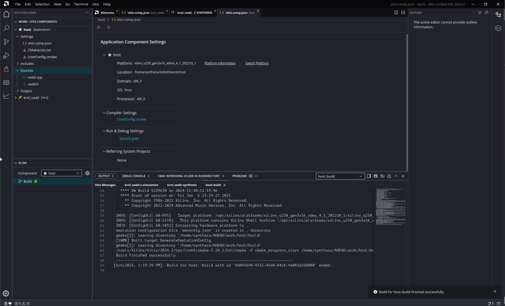
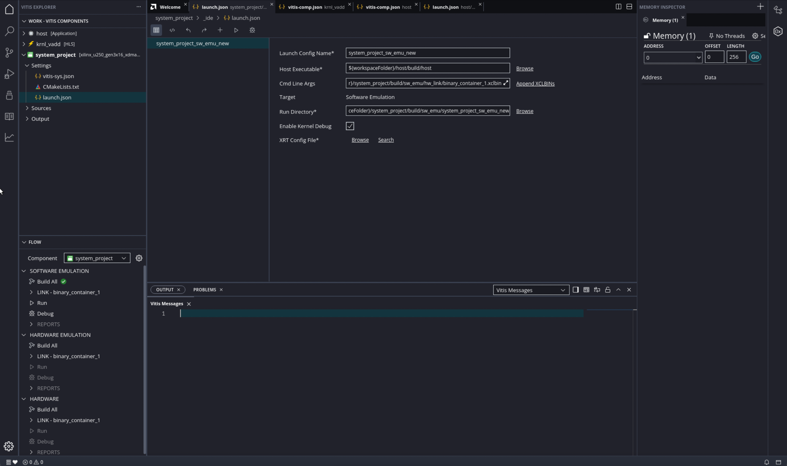
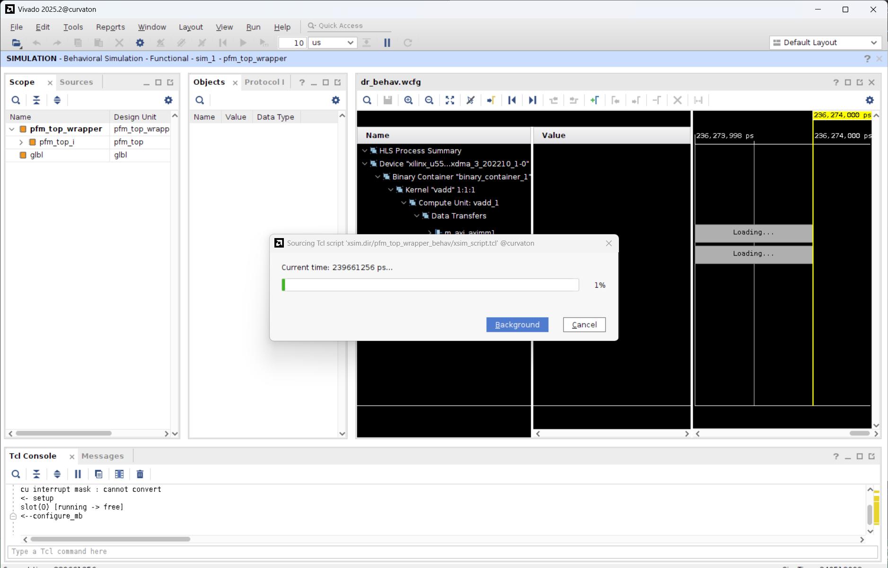

<h1>Vitis™ Example Tutorial</h1>

## Creating Application Component

The Application component is an application that runs on the processor, Arm or x86, that loads and runs the device binary (`.xclbin`) which you will build later. The Vitis unified IDE automatically detects whether the Application component uses XRT native API or OpenCL and compiles the code as needed. Create the Application component using the following steps:

1. From the main menu select **File > New Component > Application**
2. Enter the **Component name** as `host`, and the **Component location** as the workspace (default), then click **Next**.
3. On the *Select Platform* page, choose the `xilinx_u55c_gen3x16_xdma_3_202210_1` platform.
4. Click the **Add Files** icon and import `vadd.cpp` and `vadd.h` from `<downloaded_git_repo_path>/AHEAD/AHEAD_2025/vadd/src/`
5. Review the *Summary* page and click **Finish**.
6. Once imported, select `vadd.cpp` in the Component Explorer to view it in the Code Editor.
7. Click **Build** to compile for X86 Simulation or Hardware.

## Creating System Project

The System project is where different components are integrated into a complete system.

### Create the System Project

1. Select **File > New Component > System Project**
2. Enter the name as `system_project` and use the default location. Click **Next**.
3. On the *Select Platform* page, choose `xilinx_u55c_gen3x16_xdma_3_202210_1`, click **Next**, then **Finish**.

> **Tip:** Instructions for downloading and installing platform files can be found [here](https://docs.amd.com/r/en-US/ug1301-getting-started-guide-alveo-accelerator-cards/XRT-and-Deployment-Platform-Installation-Procedures-on-RedHat-and-CentOS)

4. Open the generated `vitis-sys.json`. Scroll to the **Components** section and click **Add Existing Component** to add the HLS and host components.

  
---

## Building and Running Emulation in the System Project

You can see there are two different build targets as described below: 

* Hardware Emulation: The kernel code is compiled into a hardware model (RTL), which is run in the Vivado logic simulator. This build-and-run loop takes longer but provides a detailed, cycle-accurate view of kernel activity. This target is useful for testing the functionality of the logic that will go into the Programmable Logic (PL) region of the device and getting initial performance estimates. 
* Hardware: The kernel code is compiled into a hardware model (RTL) and then implemented on the device, resulting in a binary that will run on the actual hardware.
> Note: Older versions of Vitis also allowed for: 
Software Emulation: The kernel code and host application are compiled to run on the X86 processor rather than the embedded processor of the platform. The new Vitis unified IDE uses the PS on X86 emulation flow as previously discussed. The software emulation target allows quick iterative algorithm refinement through fast build-and-run loops. This target is useful for identifying syntax errors, performing source-level debugging of the kernel code running together with application, and verifying the behavior of the system. 

Once the System project is configured:

### 1. Build the System

In the Flow Navigator:
- Click **Build All**
- In the **Build Components** pop-up window select both **host** and **krnl_vadd**.

This runs the `v++ --link` step and builds the `.xclbin` for emulation.

### 2. Set Active Build Configuration

Use the top-right dropdown or `vitis-sys.json` editor to select:
- Open **launch.json** under **Vitis Explorer > System Project > Settings > launch.json**.
- Click on `+` icon to add congiguration
- Select **Hardware Emulation** and **Enable Kernel Debug**.
  

Repeat this for Hardware Emulation after running the emulation.

### 3. Run the Emulation

With `system_project` selected in the Flow menu, under **Hardware Emulation**, go to **Run**.

A terminal appears showing execution logs from your host and emulated kernel. Look for **Device[0]:program successful!** and **TEST PASSED** message in the console.

### 4. Run the Emulation with Waveform view

Select `launch.json` under **Vitis Explorer > System Project > Settings**. 
Click on **Search** for the **XRT Config File** and select `$(workspaceFolder)/system_project/system_project_host/runtime/hw_emu_xrt.ini`. 

Under `Sources`, navigate to the `hw_emu_xrt.ini` file. In `Device Trace`, change the setting of `Device Trace = fine`, and under `Emulation`, select `Debug mode = gui`.

Next time you **Run** hardware emulation, a new window opens, that shows live the waveform during simulation. This view can be a useful debugging tool when you observe stalls, deadlocks, or misbehaviour in general. 

---

Congratulations, you have reached the end of this tutorial! :)
