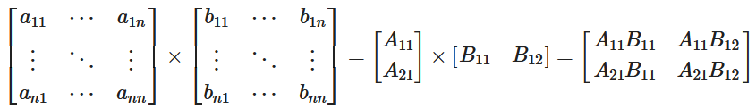

# Matrix Multiplication Accelerated IP Implementation

This tutorial has originally been designed for another FPGA platform. Don't worry, though the resource numbers you will see may be different, we can simply follow the same tutorial for the U55C :)
Collect your findings on resource and latency, so that we can discuss in the end. 

## 1. Baseline
First, we can implement a design without adding any optimization instructions or structural improvements as our baseline for optimization.

```cpp
void mmult_hw(int in1[DATA_SIZE * DATA_SIZE], int in2[DATA_SIZE * DATA_SIZE], int out[DATA_SIZE * DATA_SIZE], int dim)
{

	loop1:for (int i = 0; i < dim; i++){
	    loop2:for (int j = 0; j < dim; j++){
	        loop3:for (int k = 0; k < dim; k++){
	            out[i * dim + j] += in1[i * dim + k] * in2[k * dim  + j];
	        }
	    }
	}
}
```
We can see that this design utilizes a standard three-level nested loop structure, iterating through the positions of each element in the matrix stored in memory. It performs multiplication and addition operations before writing the results to the corresponding addresses in the output matrix also stored in memory.

This design necessitates substantial time to complete a single computation! The table below presents latency data and resource utilization rates. Analysis reveals that executing the baseline code demands over four million clock cycles. Additionally, it is evident that the resources available on the PYNQ-Z2 board are not fully leveraged.

#### Resource Utlization and Latency of Baseline
| Type     | Latency | BRAM | DSP48E | FF  | LUT | URAM |
| -------- | ------- | ---- | ------ | --- | --- | ---- |
| Baseline | 4734979 | 1%   | 5%     | 2%  | 4%  | 0%   |

Your numbers for the U55C will be different --> note them down! We do want to do the same optimization now for this board.

### 1.1 Data Access Optimization

Since accessing memory is highly time-consuming, we do not desire the accelerator to fetch data from memory every time it is required. Hence, we can create an array locally and pre-store all the data needed for computation, thereby localizing the data.

```cpp
#define BLK_ROW 64

buf_t Abuf[BLK_ROW][DATA_SIZE];
buf_t Bbuf[DATA_SIZE][BLK_ROW];

int Cbuf[BLK_ROW][BLK_ROW];
```

The above code involves creating an array locally, followed by rapid data retrieval from memory via the DDR interface through nested loops. Due to limited resources on the PYNQ-Z2 board, we opt not to pursue the ideal scenario of fully localizing two $128 \times 128$ matrices. Instead, we adopt a compromise approach, localizing only the portion of data required for computation at each instance.

<center>
    
    <br>
    Figure 4 (1)
</center>

<center>
    
    <br>
    Figure 4 (2)
</center>

<center>
    
    <br>
    Figure 4 (3)
</center>

Figure 4 (2) illustrates the data read/write operations after complete data localization, while (3) represents data read/write operations after localizing half of the data. Both scenarios result in time savings compared to the baseline code, which fetches data from memory via the DDR interface on every iteration. Prior to localization, we accumulate a total of $2 \times 128^{3}$ data accesses. After caching, the required data accesses are reduced to $128^{2} + 128^{2} \times 2$ times, compressing it to $\frac{3}{256}$ of the accesses before optimization.


## 2. Block Matrix Multiplication
As the high-speed storage resources on FPGA are highly valuable; for instance, on the PYNQ-Z2 board, there are a total of 280 BRAMs, with each BRAM having a size of 18K, totaling 4.92 Mb of resources. If we cache two matrices locally, it requires $128 \times 128 \times 32b \times 2 = 1Mb$ of space for a $128 \times 128$ matrix. Although this is sufficient, it becomes inadequate as the matrix size grows larger, reaching $1024 \times 1024$. Therefore, in our approach below, we simulate the scenario of insufficient resources using a 128*128 matrix, striking a balance between time and space. We adopt a block matrix multiplication approach to address this issue.

<center>
    
    <br>
    Figure 4 (3)
</center>

The principle of block matrix multiplication is illustrated in the equation. We partition the original matrix into two $128 \times 64$ submatrices and two $64 \times 128$ submatrices, pairing them off for local caching. By performing multiplication on two of these submatrices, we obtain a portion of the output matrix result. Consequently, our space requirement reduces to half of the original, while simultaneously reducing the number of data read operations to $\frac{3}{2N}$ of the original count.

```cpp
//Code of Block Matrix Multiplication 
#define A_BLK_NUM DATA_SIZE/BLK_ROW   
#define B_BLK_NUM DATA_SIZE/BLK_ROW   
 
SWEEP_B_BLK:    
	for (int i = 0; i < B_BLK_NUM; i++){    
	// load part of Bbuf 
    	SWEEP_A_BLK:    
        for (int j = 0; j < A_BLK_NUM; j++){    
        // load part of Abuf 
			COMPUTE_C_BLK:
            // computaion of Cbuf
			WRITE_C_BLK:
          	// \Brust write to output
		}
}
```
The code above describes the process of performing block computation. Initially, a portion of Bbuf and Abuf is localized, followed by computation to obtain a portion of Cbuf. At this stage, Cbuf is stored in the PL (Programmable Logic). Subsequently, Cbuf is written into the out port of PS through AXI. This process iterates, computing all four parts of out sequentially until the entire computation is completed.

### 2.1 Data type optimization and DSP usage

Currently, we are utilizing the int32 data format for matrix elements. However, given that the matrix elements are within the range of 0-255 positive integers, it presents an opportunity for space compression. In addition to supporting standard data types such as int8 and int32, FPGAs also support arbitrary precision data types.

Here, we can utilize **ap_uint<8>**, an 8-bit unsigned integer, instead of the standard integer type. This will result in a reduction of cached space by $\frac{1}{4}$ of the original size.

Simultaneously, with the data width set to 8 bits, the tool can invoke DSP to execute multiply-and-accumulate operations. DSP includes a 25-bit pre-adder with D registers, 25x18 binary multiplier, 48-bit accumulator, and three-input adder, as illustrated in Figure 7. Utilizing on-chip hard cores for multiply-and-accumulate computations will enhance computation speed and reduce power consumption. Furthermore, as we are implementing 8-bit multiplication, while the resource is a 25x18 multiplier, we can utilize a 25x17 multiplier to execute two 8-bit multiplications, thereby conserving resources.


### 2.2 Loop unrolling and pipelining

We apply pipelining to localize a portion of matrix B into the Bbuf matrix. We observe that this code consists of two nested loops, and the pipeline directive is positioned within the second loop. This implies that pipeline operations are to be performed on the contents of the second loop, rather than the first loop. From the timing diagram, we can see that the operations within the second loop are pipelined, while those within the first loop remain serial.
```cpp
// ---------------------------
// --- read b block
// ---------------------------
	READ_B_BLOCK:
	for ( int b_i = 0; b_i < DATA_SIZE; b_i++){
		for ( int b_j = 0; b_j < BLK_ROW; b_j++){
			#pragma HLS PIPELINE
			Bbuf[b_i][b_j] = in2[b_i * DATA_SIZE + b_j + i * BLK_ROW];
		}
	}


```


Subsequently, we proceed to unroll the loop for the most time-consuming operation of 128 multiply-accumulate operations. Before optimization, computing a single output element would require 128 loop iterations. After adding loop unrolling compiler directives, 128 DSP units can be simultaneously invoked to perform 128 multiply-accumulate operations, significantly reducing the computation time.

```cpp
// ---------------------------
// --- comupte c element
// ---------------------------
COMPUTE_C_ELE:
	for (int c_k = 0; c_k < DATA_SIZE; c_k++){
		#pragma HLS UNROLL
		c_tmp += Abuf[c_i][c_k] * Bbuf[c_k][c_j];
	}
```

The functionality of the above code involves performing multiply-accumulate operations using the localized matrices Abuf and Bbuf. Since there is only one loop, its functionality is consistent with that described for FIR filters. 

However, due to the use of loop unrolling, simultaneous reads and writes to Abuf and Bbuf are required, which poses challenges for the BRAM (Block RAM) storage units in the PYNQ-Z2. The port characteristics of BRAM can be simplified into single-port and dual-port configurations. BRAM operations are based on AXI (Advanced eXtensible Interface) write address (AW) and read address (AR) channels. For single-port BRAM, only one operation is allowed at a time in the kernel, while for dual-port BRAM, two operations are permitted simultaneously in the kernel. Therefore, we need to partition the array to provide more read and write ports to meet the high demand for simultaneous access at the same time.

```cpp
#pragma HLS array_partition variable=Abuf cyclic factor=64 dim=2  
#pragma HLS array_partition variable=Bbuf cyclic factor=64 dim=1
```


Array partitioning can be performed in three ways: block, cyclic, and complete, as depicted in the figure above. Block partitioning involves creating smaller arrays by partitioning the original array into contiguous blocks. Cyclic partitioning divides the array cyclically, placing one element into each new array until the entire array is partitioned. The process then repeats, starting from the first array, until the array is completely partitioned. Complete partitioning decomposes the array into multiple independent elements. Additionally, "dim" refers to the dimension of the multidimensional array to be partitioned.

Therefore, the array partitioning results for Abuf and Bbuf are as depicted in the figure below.


#### Resource Utlization and Latency of Block_acc and Baseline
| Type      | Latency | BRAM | DSP48E | FF  | LUT | URAM |
| --------- | ------- | ---- | ------ | --- | --- | ---- |
| Baseline  | 4734979 | 1%   | 5%     | 2%  | 4%  | 0%   |
| Block_acc | 88419   | 49%  | 29%    | 2%  | 23% | 0%   |


Finally, we obtain the following latency data and resource utilization rates.

As seen, compared to the unoptimized version, the latency is reduced to 88419, which is $\frac{1}{50}$ of the original value, while resource utilization significantly increases, especially in BRAM, DSP48E, and LUTs.

---------------------------------------
<p align="center">Copyright&copy; 2024 Advanced Micro Devices</p>